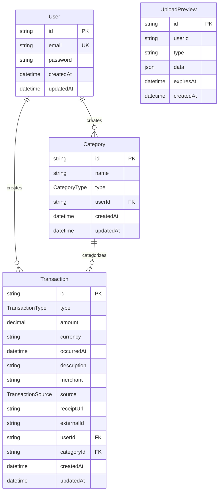

```mermaid
erDiagram
    User ||--o{ Category : creates
    User ||--o{ Transaction : creates
    Category ||--o{ Transaction : categorizes
    
    User {
        string id PK
        string email UK
        string password
        datetime createdAt
        datetime updatedAt
    }
    
    Category {
        string id PK
        string name
        CategoryType type
        string userId FK
        datetime createdAt
        datetime updatedAt
    }
    
    Transaction {
        string id PK
        TransactionType type
        decimal amount
        string currency
        datetime occurredAt
        string description
        string merchant
        TransactionSource source
        string receiptUrl
        string externalId
        string userId FK
        string categoryId FK
        datetime createdAt
        datetime updatedAt
    }
    
    UploadPreview {
        string id PK
        string userId
        string type
        json data
        datetime expiresAt
        datetime createdAt
    }
```